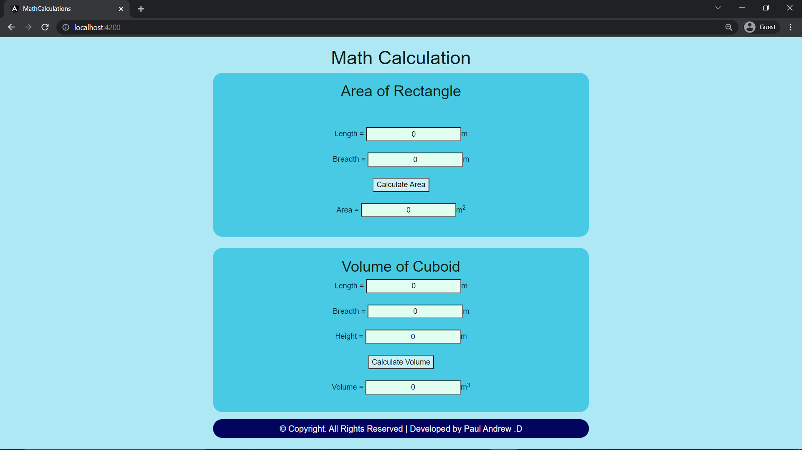
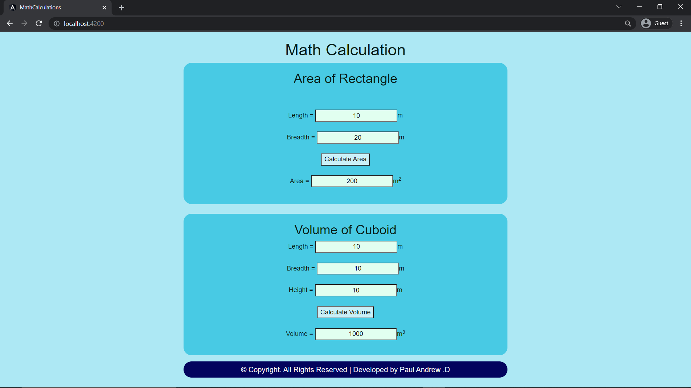

# AngularCalculation

# Web Page for Mathematical Calculations using Angular

## AIM:
To design a dynamic website to perform mathematical calculations using Angular Framwork

## DESIGN STEPS:

### Step 1:

Requirement collection.

### Step 2:

Creating the layout using HTML and CSS in component.html file

### Step 3:

Write typescript to perform the calculations.

### Step 4:

Validate the layout in various browsers.

### Step 5:

Validate the HTML code.

### Step 6:

Publish the website in the given URL.

## PROGRAM :
### app.component.html:
```
<body>
  <div class="container">
  <h1>Math Calculation</h1>
  <div class="content">
      <h2 class="padding">Area of Rectangle</h2>
      <Rectangle-Component></Rectangle-Component>
  </div>
  <br/>
  <div class="content">
      <h2>Volume of Cuboid</h2>
      <Cuboid-Volume></Cuboid-Volume>
  </div>
  <div class="footer">
    &copy; Copyright. All Rights Reserved | Developed by Paul Andrew .D
  </div>
  </div>

</body>
```
### style.css:
```
*{
    box-sizing: border-box;
    font-family: Arial, Helvetica, sans-serif;
    }
    
    body{
        background-color: #ade8f4;
        color: #081c15;
    }
    
    .container{
        text-align: center;
        width: 1080px;
        height: 850px;
        margin-left: auto;
        margin-right: auto;
        margin-top: auto;
    }
    
    .content{
        display: block;
        width: 100%;
        margin-left: auto;
        margin-right: auto;
        background-color: #48cae4;
        height: 350px;
        width: 800px;
        text-align: center;
        border-radius: 20px;
    }
    
    .padding{
        padding-bottom: 50px;
    }

    
    h1{
        color: #081c15;
        text-align: center;
        padding-top: 20px;
    }
    
    h2{
        color: #081c15;
        text-align: center;
        padding-top: 20px;
    }
    input{
        text-align: center ;
        background-color: #e1fff0;
    }

    .button{
        background-color: #caf0f8;
    }
    
    
    .footer{
        color: whitesmoke;
        margin-top: 15px;
        display: inline-block;
        height: 40px;
        width: 800px;
        background-color: #03045e; 
        text-align: center;
        padding-top: 7px;
        font-size: large;
        border-radius: 20px;
    }
    
```
### rectangle.component.html:
```
<div>
    Length = <input type="text" [(ngModel)]= "length"><a>m</a><br/>
    <br/>
    Breadth = <input type="text" [(ngModel)]= "breadth"><a>m</a><br/>
    <br/>
    <input class="button" type = "button" (click)=" onCalculateArea()" value="Calculate Area"><br/>
    <br/>
    Area = <input type="text" readonly value="0" [value]= "area"><a>m<sup>2</sup></a>
</div>
```
### rectangle.component.ts:
```
import { Component } from "@angular/core";

@Component({
    selector:"Rectangle-Component",
    templateUrl:"./rectangle.component.html"
})
export class RectangleComponent{
    length: number;
    breadth: number;
    area: number;
    constructor(){
        this.length = 0
        this.breadth = 0
        this.area = this.length*this.breadth
    }
    onCalculateArea(){
        this.area = this.length*this.breadth
    }
}
```
### cuboid.component.html:
```
<div>
    Length = <input type="text" [(ngModel)]="length"><a>m</a><br/>
    <br/>
    Breadth = <input type="text" step='0.01' [(ngModel)]="breadth"><a>m</a><br/>
    <br/>
    Height = <input type="text" [(ngModel)]="height"><a>m</a><br/>
    <br/>
    <input class="button" type="button" value="Calculate Volume" (click)="onCalculateVolume()"><br/>
    <br/>
    Volume = <input type="text"  [value]="volume"><a>m<sup>3</sup></a>
</div>
```
### cuboid.component.ts:
```
import { Component } from "@angular/core";

@Component({
    selector:"Cuboid-Volume",
    templateUrl:"./cuboid.component.html"
})
export class CuboidComponent{
    length:number;
    breadth:number;
    height:number;
    volume: number;
    constructor(){
        this.length = 0
        this.breadth = 0
        this.height = 0
        this.volume = this.length * this.breadth * this.height
    }
    onCalculateVolume(){
        this.volume = this.length * this.breadth * this.height
    }
}
```
## OUTPUT:
### Home Page(with default input):

### Home Page(with user input):

## Result:
A dynamic website to perform mathematical calculations is designed using Angular Framwork
